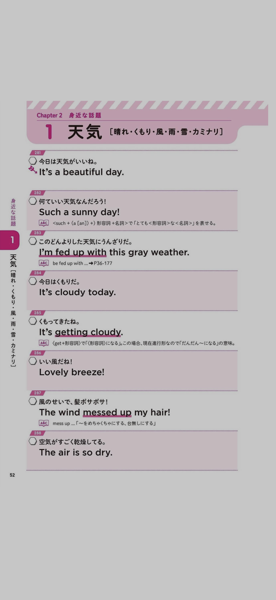

# GCP-Cloud-Vision-Api-Example
[ドキュメント テキスト検出のサンプル](https://cloud.google.com/vision/docs/detecting-fulltext#detecting_document_text_in_a_local_image)

## 編集条件
* 英語(languageCode === 'en')

## 編集後結果
```
It's a beautiful day.
Such a sunny day!
Im fed up with this gray weather.
ABC e fed up with ... P36-177
It's cloudy today.
It's getting cloudy.
Lovely breeze!
The wind messed up my hair!
The air is so dry.
```

## Input Image

